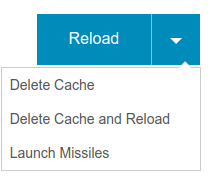

## Foundation

[Foundation][] is CSS framework.  Its goals are to significantly
reduce the amount of CSS you have to write and give you a consistent,
clean web site by default.

### What is (ZURB) Foundation?

  * A framework for CSS

  * Mobile-first design

  * Provides:

    - A grid system
    - A navigation system
    - UI controls (buttons, sliders, etc.)
    - Various pre-styled containers

  * Configurable via Sass, HTML, and JavaScript

### The Foundation Grid

The main grid system in Foundation `<=` 5.

~~~ {.html}

  

    Column with 4 Units.
  

  

    Column with 8 Units.
  

~~~

(Internally implemented with Floating or Flexbox.)

### The XY Grid

The main grid system in Foundation `>=` 6.

~~~ {.html}

  

    
A Cell

    
A Cell

    
A Cell

  

~~~

(Internally implemented with Flexbox.)

### User Interface Controls

Foundation provides a variety of user interface elements:

  * Buttons

  * Switches

  * Sliders

  * Menus

  * Navigation bars

  * Breadcrumbs

  * etc.

### Buttons

\
<!-- Placeholder -->

~~~ {.html insert="../../../src/www/css/frameworks/foundation5/index.html" token="button"}
~~~

### Split Buttons

\
<!-- Placeholder -->

~~~ {.html insert="../../../src/www/css/frameworks/foundation5/index.html" token="split"}
~~~

### Switches

\
<!-- Placeholder -->

~~~ {.html insert="../../../src/www/css/frameworks/foundation5/index.html" token="switch"}
~~~

### Sliders

\
<!-- Placeholder -->

~~~ {.html insert="../../../src/www/css/frameworks/foundation5/index.html" token="slider"}
~~~

(There are also progress bars in Foundation.)

### Foundation and Sass

Foundation is written in Sass and JavaScript.  With the full Sass
distribution of Foundation you can:

  * Change settings and colors (`_settings.scss`)

  * Recompile with Grunt, Gulp, Webpack, etc.

  * Have more control over which parts of Foundation you include in
    your project (i.e. reduce its size)

### Experimenting with Foundation

Let's take a look at a Foundation demonstration application:

  #. Open the following folder in your text editor:

        src/www/css/frameworks/foundation5

  #. Review the `index.html` file

If you are running your Node.js server you can access this
application [using this link][foundation5-demo].

<!-- === Links === -->
[foundation]: https://foundation.zurb.com
[foundation5-demo]: http://localhost:3000/css/frameworks/foundation5/
