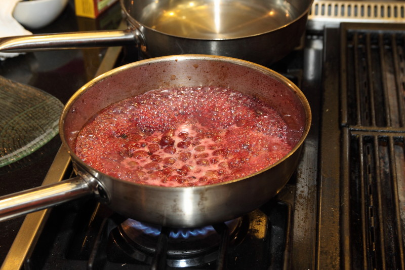

## Higher-Order Array Functions

### Common Patterns of Array Processing

* Do something for each value
* Filter array values
* Query about each value
* Transform each value
* Reduce all values into a single value

### Do Something: `#forEach`

`forEach` on an array invokes the given *callback* with each element:

```javascript
const printIncrementedArg = (arg) => {
  console.log(arg + 1)
}

const arr = [1, 2]

arr.forEach(printIncrementedArg) //  2  3
```

### forEach

\
<!-- Placeholder -->

### forEach

`Array#forEach` invokes the given *callback* once for each array element

and passes in:
 
  * the element
  * the index
  * the current array 

```javascript
['hello', 'goodbye'].forEach(console.log)

// ?
// ?
```

### forEach

`Array#forEach` invokes the given *callback* once for each array element

and passes in:
 
  * the element
  * the index
  * the current array 

```javascript
['hello', 'goodbye'].forEach(console.log)

// hello 0 ['hello', 'goodbye']
// goodbye 1 ['hello', 'goodbye']
```

### A Humble Comparison

Which one reads more like English?

```javascript
const registerUser = () => {/* ... */}
const users = [/* ... */]

for (let i = 0; i < users.length; i++) {
  registerUser(users[i])
}

// vs...

users.forEach(registerUser)
```

### An Invitation

\begin{figure}
  You could never write another `for` loop again.
\end{figure}

### Filter: `#filter`

```javascript
[1, 2, 3, 4].filter(n => n > 2)
```

\
<!-- Placeholder -->

### `#filter`

```javascript
const nums = [1, 7, 3, 2, 4, 8, 6, 5]

const lessThan5 = x => x < 5
const filteredNums = nums.filter(lessThan5)

nums // [1, 7, 3, 2, 4, 8, 6, 5]
filteredNums // [1, 3, 2, 4]
```

### Query: `#every`, `#some`

`#every` - `true` if the function (*predicate*) returns `true` for all elements:

```javascript
const nums = [1, 2, 3]
nums.every(num => num > 0) // true
nums.every(num => num > 2) // false
```

`#some` - `true` if function (*predicate*) returns `true `for any element:

```javascript
const nums = [1, 2, 3]
nums.some(num => num > 2) // true
nums.some(num => num > 4) // false
```

### Transforming: `#map`

```javascript
[1, 2, 3, 4].map(n => n + 2)
```

\
<!-- Placeholder -->

### `map`

```javascript
const shout = word => word.toUpperCase()

;['apple', 'dog', 'banana'].map(shout)
// ['APPLE', 'DOG', 'BANANA']
```

### Reducing to Single Value: `#reduce`

It's like making a reduction out of your array.



Cooking down the contents into something different.

### `#reduce`

Reduce takes a function and invokes it with every element in the array.

**Additionally** it gives the function an "accumulator"

A place to store the "rolled up" (or reduced) values of the array.

```javascript
const nums = [1, 2, 3]
let sum = 0
nums.reduce((_, num) => { sum += num })
sum // 6
``` 

### `reduce`

Rather than keeping the accumulator outside the function...

We pass it as an argument to the function.

The function *returns* what will be the next accumulator.

```javascript
const nums = [1, 2, 3]
const sum = nums.reduce((accumulator, num) => { 
  return accumulator + num // this will be passed as 
                           // `accumulator` param in
                           // the next invocation 
})
sum // 6
``` 

### Visualizing `reduce`

<http://reduce.surge.sh/>

### `reduce`

The last argument of `reduce` is the `initialValue`

for the accumulator. It defaults to the first value

of the array.

```javascript
nums.reduce((acc, num) => acc + num) // 6
nums.reduce((acc, num) => acc + num, '') // '123'
```

### `#map` vs `#reduce`

What's the difference between

`map` and `reduce`?

### `#map` vs `#reduce`

\columnsbegin
\column{.5\textwidth}

`map`: 1 : 1 transformation 

~~~ {.javascript}
e.g. `map(double)`

[ 1, --> [ 2,
  2, -->   4,
  3] -->   6]
~~~

\column{.5\textwidth}

`reduce`: 1 : ??? transformation

~~~ {.javascript}
e.g. `reduce(add)`
[ 1,
  2,
  3] -->   6
~~~

\columnsend

### `#reduce`: The Transform Swiss Army Knife

When you need to transform an `Array` that isn't 1:1 

or a filter, then it's `reduce`.

```javascript
// e.g. to an object
const pairs = [['id', 42], ['name', 'Andrew']]
const fromPairs = (pairs) => pairs.reduce((acc, [key, value]) => {
  acc[key] = value
  return acc
}, {})

const person = fromPairs(pairs)
person // { id: 42, name: 'Andrew' }
```

### Exercise: Arrays and Functional Programming

  #. Open `src/www/js/functional/array.test.js`
  
  #. Follow directions in the `it` statements
  
  #. All tests should keep passing 

```shell
$ cd src
$ yarn jest array.test.js --watch
```
