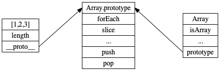
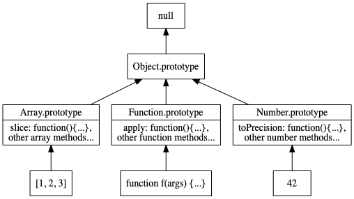
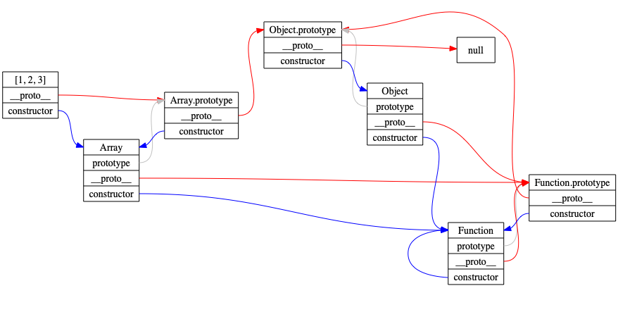

## Constructor Functions

### Constructor Functions

So, `Object.create` is great and all, but cumbersome.

You can't set values on creation!

Thus, we have **`constructor functions`**.

```javascript
const colorizer = function(color) {
  this.color = color
  this.hasColor = true
}

const z = new colorizer('green')
z.color // 'green'
z.hasColor // true
z.constructor === colorizer // true
```

### Constructor Functions

Values set inside the constructor function aren't shared across instances.

```javascript
const colorizer = function() {
  this.color = 'green'
}
const x = new colorizer()
const y = new colorizer()
x.color = 'blue'

x.color // 'blue'
y.color // 'green'
```

### The `new` Operator

The `new` operator creates a new object, invokes the constructor function with the new object as its execution context, and sets its `__proto__` property to the function's `prototype` property.

... Yikes.

### The `new` Operator

Basically:

```javascript
const foo = function(a, b, c) {/* ... */}

let y = new foo(1, 2, 3)

// Is like:

let y = Object.create(foo.prototype)
y = foo.call(y, 1, 2, 3) || y
```

### The `new` Operator

That's why you can set `this.whatever` values and it gets set on the instance.

```javascript
const ageify = function(age) {
  this.age = age
}
const x = new ageify(27)
x.age // 27
```

### Function Prototypes

Functions get a **`prototype`** property

```javascript
const f = function() {}

f.__proto__ === Function.prototype // true
Function.prototype.__proto__ === Object.prototype // true
Object.prototype.__proto__ === null // true
```

### Function Prototypes

Fun fact: 

**arrow functions do not get a prototype property**

```javascript
const foo = () => {}

foo.prototype // undefined
```

Any guesses as to why?

### Function Prototypes

Shared information goes on the function's `prototype` property.

```javascript
const person = function() {}
person.prototype.species = 'Homo sapien'

const instructor = new person()
instructor.__proto__ // person.prototype
instructor.species // 'Homo sapien'
```

### Naming Convention

Constructor functions are generally given a capitalized name.

```javascript
const Person = function() {}
const person = new Person()
```

The capitalization doesn't give special behavior, it's just convention.

### Looking at `Array` Instances



### The Prototype Chain



### Another Look at `Array` Instances



### Constructor Functions and OOP

~~~ {.javascript insert="../../../src/examples/js/inheritance.js" token="rec"}
~~~

### Exercise: Constructor Functions

  #. Open `src/www/js/oop/constructors.test.js`
  
  #. Follow directions in the `it` statements
  
  #. All tests should keep passing 

```shell
$ cd src
$ yarn jest constructors.test.js --watch
```

### Inheritance in Constructor Functions

We want:  

```
f2Instance --> f2.prototype ---> f1.prototype
```

Set `f2`'s `prototype` to have a `__proto__` of `f1.prototype`

Confused yet? 

### Inheritance in Constructor Functions

```javascript
const foo = function() {}
foo.prototype.fooProp = 'foo prop'

const bar = function() {}
bar.prototype = Object.create(foo.prototype)

const b = new bar()
b.fooProp
``` 

### Inheritance in Constructor Functions

You can also implement `super` behavior in the constructor:

~~~ {.javascript insert="../../../src/examples/js/inheritance.js" token="super-constructor"}
~~~

### Inheritance in Constructor Functions

~~~ {.javascript insert="../../../src/examples/js/inheritance.js" token="sq"}
~~~

### Generic Functions (Static Class Methods)

Functions that are defined as properties of the constructor function
are known as *generic* functions:

~~~ {.javascript insert="../../../src/examples/js/inheritance.js" token="generic"}
~~~

### Property Descriptors

Setting property descriptors:

~~~ {.javascript}
Object.defineProperty(obj, propName, definition);
~~~

  * Define (or update) a property and its configuration

  * Some things that can be configured:
    - `enumerable`: If the property is enumerated in `for .. in` loops
    - `value`: The property's initial value
    - `writable`: If the value can change
    - `get`: Function to call when value is accessed
    - `set`: Function to call when value is changed

### Property Getters and Setters

~~~ {.javascript insert="../../../src/examples/js/descriptors.js" token="get-set"}
~~~

### Object-Oriented Programming: Gotcha

What's wrong with the following code?

~~~ {.javascript insert="../../../src/examples/js/this.js" token="gotcha"}
~~~

### Accessing `this` via the `bind` Function

Notice where `bind` is used:

~~~ {.javascript insert="../../../src/examples/js/this.js" token="this-bind"}
~~~

### Accessing `this` via a Closure Variable

Create an alias for `this`:

~~~ {.javascript insert="../../../src/examples/js/this.js" token="this-alias"}
~~~

### Accessing `this` Directly via ES2015 Arrow Functions

Using the ES2015 *arrow function* syntax:

~~~ {.javascript insert="../../../src/examples/js/this.js" token="this-arrow"}
~~~

### Exercise

  #. Open `src/www/js/oop/fn-inheritance.js`

  #. Open `src/www/js/oop/fn-inheritance.test.js`
  
  #. Follow directions in the `it` statements
  
  #. All tests should pass

```shell
$ cd src
$ yarn jest fn-inheritance.test.js --watch
```
