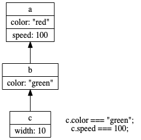
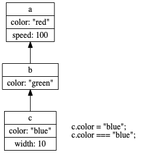

The Prototype
-------------

### Inheritance in JavaScript

* JavaScript doesn't use classes, it uses **prototypes**
* Prototypal inheritance:
  * Tends to be smaller
  * Less redundant
  * Can simulate classical inheritance as needed
  * More powerful

### Inheriting Properties from Other Objects



### Setting Properties and Inheritance



### Establishing Inheritance

**`Object.create`** creates a new object with the provided object as the prototype.

```javascript
const a = { color: 'red', speed: 100 }

const b = Object.create(a)
b.speed // 100
b.color = 'green'

const c = Object.create(b)
c.speed // 100
c.color // 'green'
```

### Turtles All the Way Up


### Object.create

`Object.create` creates a new object and sets the `__proto__` property.

```javascript
const a = { color: 'red', speed: 100 }

const b = Object.create(a)
b.speed // 100
b.__proto__ === a // true
```

### Turtles All the Way Up

```javascript
const a = {}
const b = Object.create(a)
const c = Object.create(b)

c.__proto__ // b
b.__proto__ // a
a.__proto__ // Object.prototype
Object.prototype.__proto__ // null
```

### Prototypes

* Every object has a `__proto__` **prototype**
* The path of prototype objects is the **prototype chain**
* Properties not found on an object will be check up the prototype chain

### Using `__proto__`

`__proto__` is *technically* non-standard, but de-facto available

The "standard" is `Object.getPrototypeOf()`

Can be set after the fact with `Object.setPrototypeOf()`

### Setting the Prototype

These are very different in performance:

```js
const a = { color: 'green' }

// fast!
const b = Object.create(a)

// sloooooow
const c = {}
Object.setPrototypeOf(c, a)
c.color
```

### The Buck Stops Here

You can check if an object (and not one of the prototypes) has the property:

```javascript
const a = { color: 'green', speed: 100 }
const b = Object.create(a)
b.speed = 100

b.hasOwnProperty('speed') // true
b.hasOwnProperty('color') // false
```

### Inheriting Behavior

Function properties further up the prototype chain refer to `this` the way you'd expect.

Remember: it's all about the calling context!

```javascript
const a = {
  name: 'Andrew',
  getName() { return this.name },
}

const b = Object.create(a)
b.name = 'Foo'
b.getName() // 'Foo'
```

### Exercise

  #. Open `src/www/js/oop/create.test.js`
  
  #. Follow directions in the `it` statements
  
  #. All tests should pass 

```shell
$ cd src
$ yarn jest create.test.js --watch
```
