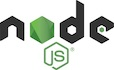

### Node.js

  * JavaScript runtime outside the browser

  * Now you can run JavaScript on a server or in your terminal!

  * Write whatever you want in JavaScript: servers, CLI, etc.

  * Most web development tools these days are written in JavaScript

### npm

  * Repository of JavaScript packages: libraries, frameworks, and tools

  * Manages packages for your project

  * Tool to publish new packages to share with the world

  * Run scripts or build processes

  * 1.2M+ packages available

### yarn

  * Sprouted as competitor to `npm`

  * Faster, more features, and more natural syntax

### Which Should I Use?

  * Both are great

  * Pick one and stick with it across the project

  * My experience: `yarn` is ~30% better

### Managing Packages

  * You specify your project's packages with `package.json`

  * **`dependencies`**: packages needed in production

  * **`devDependencies`**: packages needed for local development

  * **`engines`**: Specify which Node / npm is required

  * Uses semver

### Adding Packages

  * Create your `package.json`

  * Add dependencies: `yarn add ...`

  * Add devDependencies: `yarn add -D ...`

  * Or add an entry in your `package.json`

### Installing and Managing Packages

  * Install: `yarn`

  * This creates a `yarn.lock` lockfile

  * A lockfile ensures subsequent installs use *the same exact packages*
