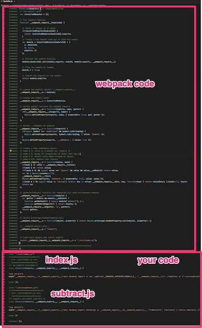
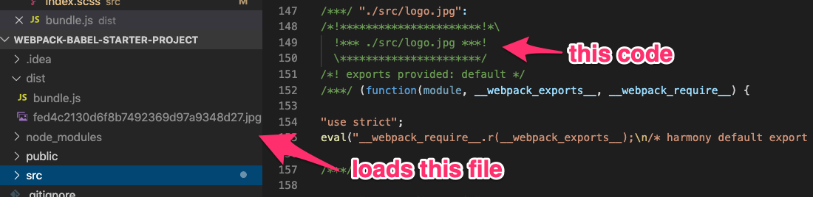

### Before There Was Webpack...

Say you had three JS files:

```javascript
// add.js
const add = (a, b) => a + b

// subtract.js
const subtract = (a, b) => a - b

// index.js
// HOW DO YOU GET add AND subtract?!
console.log('1 + 2 =', add(1, 2))
console.log('2 - 1 =', subtract(2, 1))
```

### Before There Was Webpack...

```html
<script src="./add.js" />
<script src="./subtract.js" />
<script src="./index.js" />
```

Prints out:

```
1 + 2 = 3    index.js:2
8 - 2 = 6    index.js:3
```

### But This Pollutes Global Scope

```javascript
typeof(add)  // "function"
typeof(subtract) // "function"
```

### Also, Order Mattered

```html
<script src="./index.js" />
<script src="./add.js" />
<script src="./subtract.js" />
```

Prints out:

```
index.js:2 Uncaught ReferenceError: add is not defined
```

### Prior "Art"

  * Wrap everything in IIFEs for protection
  * Concatenate all your JS into a single file
  * Hope every individual file was authored correctly

Or...

  * Roll your own module system

### Eventually That Became...

**Concat All The Things**: Grunt, Gulp, Broccoli

**Modules**: Browserify

### Then Along Came Webpack

And showed everyone how it's done.

### What is Webpack?


  * A build tool for web applications

  * Bundles all JavaScript files into a single, browser-safe JS file

  * Can be configured to process files as they're imported

    * Transpiling JS, linting, sizing images, etc.

  * Bring content into JS files (CSS, images, JSON, etc.)

### Other Benefits

  * Dev Server + Live Reloading

  * Hot Module Replacement

  * Source Maps

  * Caching

  * Code Splitting + Lazy-loading

  * Optimization (minification, tree-shaking, chunking)

### Bundling JavaScript Modules

Webpack will:

  #. Start with your "entry" JavaScript file

  #. Follow all `import` and `require` statements

  #. Generate a single file containing all JavaScript

The generated file is know as a *bundle*.

### Bundling JS

~~~ {.javascript}
// index.js
import { subtract } from './subtract'

const add = (a = 1, b = 2) => a + b

console.log(add(1, 2), subtract(8, 2))

// subtract.js
export const subtract = (a, b) => a - b
~~~

### Bundle Layout



### Bundling Images

~~~ {.javascript}
import logo from './logo.jpg'

const component = () => {
  const element = document.createElement('div')

  const webpackLogo = new Image()
  webpackLogo.src = logo
  element.appendChild(webpackLogo)

  return element
}
~~~

### Bundling Images



### Bundling Stylesheets

Now you can have localized stylesheets that connect to your JS.

Importing SCSS or CSS...

~~~ {.javascript}
// index.js
import './index.scss'
~~~

### Bundling Stylesheets

Can inject style sheets directly into the DOM for you.

~~~
/***/ "...css-loader/dist/cjs.js!./src/index.scss":

...
eval("// ..."\\n#root {\\n  background-color: lightblue;\\n}
...# sourceURL=webpack:///./src/index.scss...);
~~~

Other performance optimizations are available.

### CSS Modules

Webpack will even help with CSS modules, if that's your jam.

~~~
/* style.css */
.className {
  color: green;
}
~~~

~~~ {.javascript}
import styles from "./style.css"

element.innerHTML = '<div class="' + styles.className + '">'
~~~

### More Power Through Loaders

Webpack becomes a full build tool via **[loaders](https://webpack.js.org/loaders)**.

`babel-loader`
  : Transpiles JavaScript using Babel

`file-loader`
  : Load files (JPG, PNG, etc.)

`css-loader`
  : Process CSS

`sass-loader`
  : Process and bundle Sass

`eslint-loader`
  : Lints JavaScript using ESLint

`html-loader`
  : Bundle HTML templates

### Configuring Webpack

Configuration file: `webpack.config.js`

  * `entry`: Tell Webpack what file is the main JavaScript file

  * `output`: Tell where to put the bundled assets

  * `module.rules`: Specify which files go through which loaders.
    Each `rule` takes

    * `test`: regex to see if it applies to the file

    * `loader`: what loaders to user

### Example Module Rules: JS Transpiling

```
yarn add babel-loader
```

~~~ {.javascript}
module: {
  rules: [
    {
      test: /\.(js|jsx)$/,  // matches JS or JSX
      exclude: /(node_modules)/,  // skip node_modules
      loader: 'babel-loader'  // run through babel-loader
    },
  ]
},
~~~

### Should I Transpile `node_modules`?

  * Don't transpile your `node_modules`, it'll slow your build 10x
  * Transpiling (can) guarantee browser compatibility
  * npm libraries *usually* transpile to ES5 (basically, IE 11)
  * That's not always the case anymore
  * Suss out non-ES5-friendly libraries with [`are-you-es5`](https://github.com/obahareth/are-you-es5)
    * `npx are-you-es5 check /your/repo`

### Example Module Rules: CSS

```
yarn add style-loader css-loader
```

~~~ {.javascript}
module: {
  rules: [
    {
      test: /\.s?css$/,
      use: ["style-loader", "css-loader"]
    },
    {
      test: /\.(png|svg|jpg|gif)$/,
      use: ['file-loader'],
    }
  ]
  },
~~~

### Example Module Rules: Images

```
yarn add file-loader
```

~~~ {.javascript}
module: {
  rules: [
    {
      test: /\.(png|svg|jpg|gif)$/,
      use: ['file-loader'],
    }
  ]
},
~~~

### Dev Server

  * Changes are automatically re-bundled by webpack
  * **Live Reload**: changes trigger a browser refresh

### Webpack Demonstration

### Exercise

Let's take a look at a Webpack demonstration application:

  #. Open the [`webpack-babel-starter-project`](https://github.com/AndrewSouthpaw/webpack-babel-starter-project) repo

    - github.com/AndrewSouthpaw/webpack-babel-starter-project

  #. Follow the "Build Your Own" README steps

  #. Add the ability to load an image

### Resources

  * Webpack + Babel starter: [webpack-babel-starter-project](https://github.com/AndrewSouthpaw/webpack-babel-starter-project)
  * Webpack Docs: https://webpack.js.org/guides/
  * Frontend Masters: [Webpack Fundamentals](https://frontendmasters.com/courses/webpack-fundamentals/)
  * Frontend Masters: [Webpack Performance](https://frontendmasters.com/courses/performance-webpack/)
